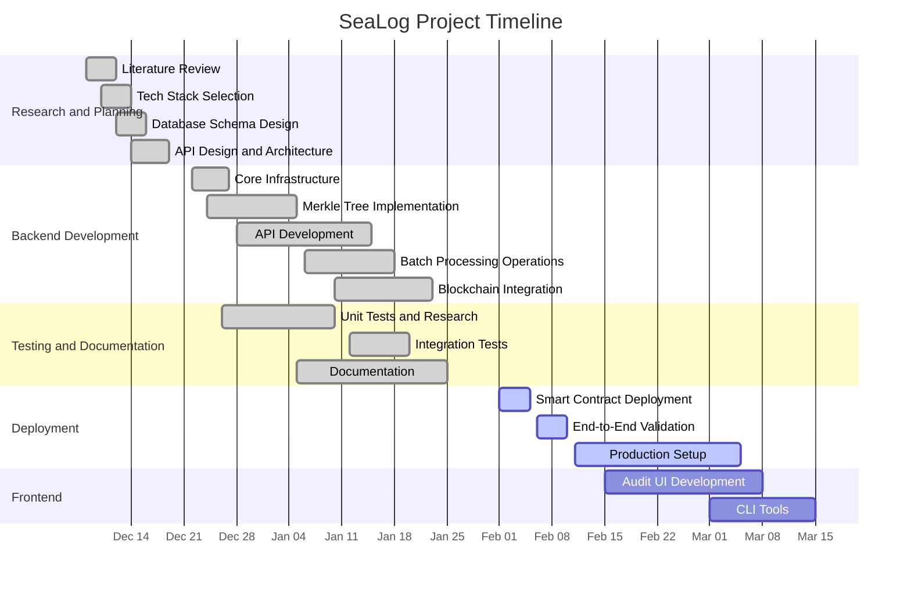

# SeaLog - Project Timeline & Gantt Chart

## Project Timeline (Dec 8, 2025 - Mar 15, 2026)

**Expected Completion: March 15, 2026**

---

## Timeline Breakdown

### Phase 1: Research & Core Development (Dec 8 – Dec 19)
**Duration:** 12 days | **Status:** ✅ Complete (100%)

- Literature review on audit logging and blockchain systems
- Tech stack finalization (PostgreSQL, Node.js, TypeScript, Hardhat)
- Database schema design with immutability enforcement
- API architecture and endpoint planning

---

### Phase 2: Backend Implementation (Dec 22 – Jan 25)
**Duration:** 35 days | **Status:** ✅ Complete (100%)

**Core Infrastructure (Dec 22-27):**
- PostgreSQL + Prisma ORM setup
- Docker Compose configuration
- TypeScript/ESLint/Prettier configuration

**Cryptographic Module (Dec 24 - Jan 5):**
- Merkle Tree implementation (position-preserving)
- Keccak-256 hashing integration
- Proof generation/verification algorithms
- Cross-batch hash chaining & zero-trust verification

**API Development (Dec 28 - Jan 15):**
- 7 REST endpoints implemented
- Zod validation schemas
- Express.js server setup

**Batching & Processing (Jan 6-18):**
- Configurable batching strategies
- Automatic batch creation
- Proof caching system

**Blockchain Integration (Jan 10-23):**
- Smart contract development (SeaLogAnchor.sol)
- Ethers.js integration
- Transaction signing logic

---

### Phase 3: Integration & Testing (Dec 26 – Jan 25)
**Duration:** 31 days (concurrent with backend) | **Status:** ✅ 90% Complete

**Unit Testing (Dec 26 - Jan 10):**
- 28/28 core crypto & research tests passed ✅
- Determinism, hash chaining, and tamper detection tests

**Integration Testing (Jan 12-20):**
- 1/1 end-to-end test passed ✅
- 0/3 blockchain tests (pending deployment) ⏸️

**Documentation (Jan 5-25):**
- 6 comprehensive technical documents
- API documentation
- Testing guides

---

### Phase 4: Containerization & Deployment (Feb 1 - Mar 5)
**Duration:** ~5 weeks | **Status:** 🔄 In Progress

**Smart Contract Deployment (Feb 1-5):**
- Deploy to Sepolia testnet 🔄
- Contract verification on Etherscan 🔄
- Record deployment details 🔄

**End-to-End Validation (Feb 6-10):**
- Blockchain integration tests 🔄
- Offline verification testing 🔄
- Audit bundle generation tests 🔄

**Production Setup (Feb 11 - Mar 5):**
- Monitoring and alerting setup �
- Production infrastructure �
- CI/CD pipeline �

---

### Phase 5: Frontend Development (Feb 15 - Mar 15)
**Duration:** ~4 weeks | **Status:** � Planned

**Audit Interface (Feb 15 - Mar 8):**
- React.js web UI �
- Verification portal �
- Batch explorer �

**CLI Tools (Mar 1-15):**
- Command-line verification utilities �
- Offline audit tools �

---

## Project Metrics

**Total Duration:** 14 weeks (Dec 8 - Mar 15)  
**Completed To Date:** ~75-80%  
**Expected Final Completion:** March 15, 2026  
**Lines of Code:** ~5,000+  
**Test Coverage:** 28/31 tests passed (90%)  
**Documentation:** 6 comprehensive guides

---

## Milestones Achieved

- ✅ **Dec 19:** Core architecture and design complete
- ✅ **Jan 5:** Merkle Tree cryptographic module locked (v1.0.0-crypto-locked)
- ✅ **Jan 15:** All API endpoints functional
- ✅ **Jan 23:** Smart contract code complete
- ✅ **Jan 25:** Testing and documentation phase complete
- ⏸️ **Feb 2:** Blockchain deployment (pending)

---

*Last Updated: 2026-02-01*
