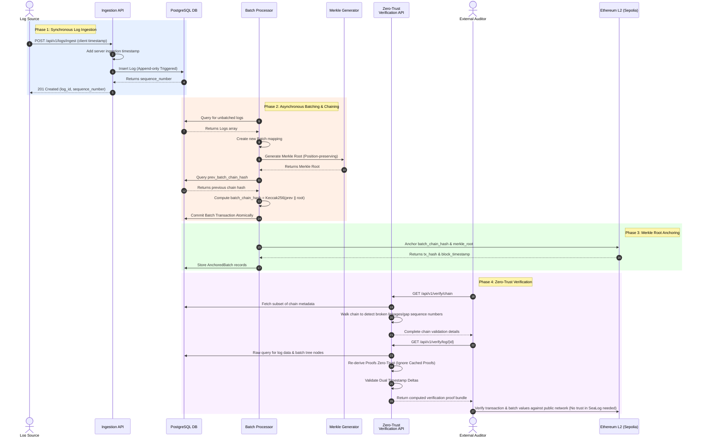

# SeaLog Sequence Diagram

```mermaid
sequenceDiagram
    autonumber
    
    actor Source as Log Source
    participant API as Ingestion API
    participant DB as PostgreSQL DB
    participant Batch as Batch Processor
    participant Merkle as Merkle Generator
    participant Verification as Zero-Trust<br/>Verification API
    actor Auditor as External Auditor
    participant L2 as Ethereum L2 (Sepolia)

    rect rgb(230, 240, 255)
        note right of Source: Phase 1: Synchronous Log Ingestion
        Source->>API: POST /api/v1/logs/ingest (client timestamp)
        API->>API: Add server ingestion timestamp
        API->>DB: Insert Log (Append-only Triggered)
        DB-->>API: Returns sequence_number
        API-->>Source: 201 Created (log_id, sequence_number)
    end

    rect rgb(255, 240, 230)
        note right of Batch: Phase 2: Asynchronous Batching & Chaining
        Batch->>DB: Query for unbatched logs
        DB-->>Batch: Returns Logs array
        Batch->>Batch: Create new Batch mapping
        Batch->>Merkle: Generate Merkle Root (Position-preserving)
        Merkle-->>Batch: Returns Merkle Root
        Batch->>DB: Query prev_batch_chain_hash
        DB-->>Batch: Returns previous chain hash
        Batch->>Batch: Compute batch_chain_hash = Keccak256(prev || root)
        Batch->>DB: Commit Batch Transaction Atomically
    end
    
    rect rgb(230, 255, 230)
        note right of L2: Phase 3: Merkle Root Anchoring
        Batch->>L2: Anchor batch_chain_hash & merkle_root
        L2-->>Batch: Returns tx_hash & block_timestamp
        Batch->>DB: Store AnchoredBatch records
    end
    
    rect rgb(250, 240, 255)
        note right of Auditor: Phase 4: Zero-Trust Verification
        Auditor->>Verification: GET /api/v1/verify/chain
        Verification->>DB: Fetch subset of chain metadata
        Verification->>Verification: Walk chain to detect broken linkages/gap sequence numbers
        Verification-->>Auditor: Complete chain validation details
        
        Auditor->>Verification: GET /api/v1/verify/log/{id}
        Verification->>DB: Raw query for log data & batch tree nodes
        Verification->>Verification: Re-derive Proofs Zero-Trust (Ignore Cached Proofs)
        Verification->>Verification: Validate Dual Timestamp Deltas
        Verification-->>Auditor: Return computed verification proof bundle
        Auditor->>L2: Verify transaction & batch values against public network (No trust in SeaLog needed)
    end
```
